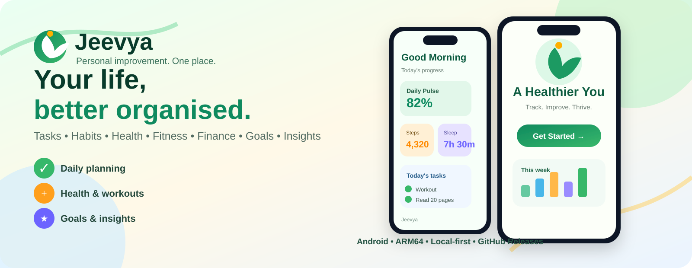

# Jeevya

Jeevya is a personal improvement and life-management app built with Expo React Native. It brings daily planning, tasks, habits, health, workouts, nutrition, sleep, recovery, finance, books, goals, insights, and Android home-screen widgets into one local-first experience.

**Current release:** 1.1.0  
**Platform:** Android, iOS, Web  
**Repository:** https://github.com/Aaditya-kumar-singh/jeevya



> **Build your better day in one place.** Jeevya combines planning, habits, health, fitness, finance, goals, books, journal entries, insights, and Android home-screen widgets in one colourful personal-improvement experience.

## What can a user do with Jeevya?

### Dashboard
- See a daily overview of progress.
- View Daily Pulse and progress indicators.
- See tasks, health information, finance information, and quick actions from one place.
- Use Jeevya as a single starting point for the day.

### Tasks and daily planning
- Create and manage daily tasks.
- Track completion and progress.
- Use the daily plan to organise what needs attention.
- Keep important actions accessible from the dashboard.

### Habits
- Track recurring habits.
- Monitor habit progress and streak-oriented information.
- Keep daily behaviour tracking alongside tasks and goals.

### Health and fitness
- Build workouts and organise exercises.
- Start and track workout sessions.
- Track sets, reps, rest timers, duration, volume, and personal records.
- Review completed workout history.
- Browse the exercise library.
- Track sleep, recovery, water, calories, protein, carbohydrates, and fat.
- Use the dedicated gym and health flows.

### Nutrition
- Track nutrition-related metrics.
- Monitor calories and macronutrients.
- Keep nutrition information together with health and workout progress.

### Finance
- Track spending.
- Work with budgets.
- Track savings and financial progress.
- Keep personal finance information inside the same life dashboard.

### Goals and books
- Create and track personal goals.
- Track reading and book progress.
- Connect long-term goals with daily progress.

### Journal and life tracking
- Maintain journal entries.
- Review life timeline information.
- Explore historical analytics and personal insights.

### Life Intelligence
- Combine information from different areas of life.
- Surface progress and analytics across multiple domains.
- Use the app as a central personal-improvement dashboard rather than a single-purpose tracker.

## Android Home-Screen Widgets

Jeevya 1.1.0 introduces a configurable Android widget system.

Users can open:

**Settings → Home-screen Widgets → Widget Studio**

From Widget Studio they can:

- Create multiple widget configurations.
- Rename widgets.
- Add modules from Jeevya.
- Remove modules.
- Reorder modules.
- Choose Daily, Health, Finance, or Progress presets.
- Choose widget size.
- Choose layout.
- Choose compact or detailed density.
- Choose background and accent styling.
- Configure different widgets independently.

Available widget modules currently include:

- Tasks
- Habits
- Workout
- Sleep
- Recovery
- Calories
- Protein
- Carbohydrates
- Fat
- Water
- Finance spending
- Finance budget
- Savings
- Books
- Goals
- Daily Pulse
- Daily Plan
- Life Intelligence

This means a user can have different widgets for different purposes, for example:

```text
Widget 1: Daily
Tasks + Habits + Daily Pulse

Widget 2: Health
Workout + Sleep + Recovery + Water

Widget 3: Finance
Spending + Budget + Savings

Widget 4: Progress
Goals + Books + Daily Pulse + Life Intelligence
```

## Data and privacy model

Jeevya is designed with a local-first approach.

- Workout data is persisted locally using AsyncStorage.
- The application can continue working with local data without requiring a constant network connection.
- Supabase is used where cloud functionality is enabled.
- Client-side configuration must use publishable Supabase credentials.
- Supabase service-role credentials must never be placed in Expo client code.
- Widget snapshots are designed to avoid exposing authentication credentials or synchronization metadata.

## How to download Jeevya

### Android

The recommended distribution method is the GitHub **Releases** page. The current v1.1.0 Android build is generated automatically with Expo prebuild + Gradle, signed with the Jeevya release key, and published as a GitHub Release.

| Android device family | Support |
| --- | --- |
| Redmi / Xiaomi | ARM64 Android build |
| Samsung Galaxy | ARM64 Android build |
| realme | ARM64 Android build |
| vivo | ARM64 Android build |
| OPPO | ARM64 Android build |
| OnePlus | ARM64 Android build |
| Other modern Android phones/tablets | ARM64 Android build |

> **Compatibility note:** Jeevya's release APK is built for modern ARM64 Android devices. Exact installation and behaviour can vary with Android version, vendor software, and device-specific restrictions.

1. Open the Jeevya repository:
   https://github.com/Aaditya-kumar-singh/jeevya
2. Open **Releases**.
3. Select the latest stable release.
4. Under **Assets**, download the Android `.apk`.
5. Open the APK on an Android phone and install it.
6. If Android asks for permission to install an app from that source, allow installation for the browser/file manager being used.

Latest release page:

https://github.com/Aaditya-kumar-singh/jeevya/releases/latest

GitHub supports attaching binary files such as APKs to releases, and users can download those release assets directly. See the GitHub release documentation for the release/download URL behaviour.

> **Current distribution status:** Jeevya v1.1.0 has an Android APK attached to its GitHub Release. Download it from the release page and install it on a compatible ARM64 Android device.

### Developers: run from source

Requirements:

- Node.js
- npm
- Expo-compatible development environment
- Android Studio/Android SDK for a local Android build

Install:

```bash
git clone https://github.com/Aaditya-kumar-singh/jeevya.git
cd jeevya
npm install
```

Start the development server:

```bash
npx expo start
```

For Android:

```bash
npm run android
```

For web:

```bash
npm run web
```

## Tech stack

- Expo SDK 57
- React Native 0.86
- React 19
- TypeScript
- Expo Router
- NativeWind
- gluestack-ui
- Lucide React Native
- Supabase
- AsyncStorage
- react-native-android-widget
- React Native Reanimated
- React Native SVG

## Project structure

```text
src/
├── app/                 # Expo Router screens
├── components/          # Reusable UI and dashboard components
├── constants/           # Theme and design tokens
├── hooks/               # Application hooks
├── lib/                 # Storage, Supabase and shared utilities
├── services/             # Domain services and repositories
├── types/                # TypeScript domain models
└── widgets/              # Android widget rendering and handlers

sql/                     # Supabase database schemas
scripts/                 # Development and data-import scripts
assets/                  # App icons and visual assets
```

## Supabase setup

Create a local environment file using publishable client credentials:

```text
EXPO_PUBLIC_SUPABASE_URL=https://<project-ref>.supabase.co
EXPO_PUBLIC_SUPABASE_KEY=sb_publishable_...
```

Never place a Supabase service-role key in Expo client code.

The exercise importer uses a server-side environment:

```text
SUPABASE_URL=https://<project-ref>.supabase.co
SUPABASE_SERVICE_ROLE_KEY=sb_secret_...
```

Import the exercise dataset with:

```bash
npm run exercises:import
```

## Workout Engine

The workout system includes:

- Workout builder
- Exercise selection
- Sets and reps
- Rest timer
- Active workout sessions
- Pause/resume behaviour
- Personal record detection
- Volume calculation
- Workout duration
- Workout history
- Workout details
- Local persistence

Every workout mutation is persisted immediately to local storage.

## Development commands

```bash
npm install
npx expo start
npm run android
npm run ios
npm run web
npm run lint
npm test -- --runInBand
npm run test:checks
npm run test:all
npx tsc --noEmit
npx expo-doctor
```

## Release validation

Jeevya 1.1.0 was validated with:

- TypeScript: PASS
- Expo Doctor: 21/21 checks passed
- Jest smoke tests: 4/4 passed
- Project checks: PASS
- Phase 2H checks: 127/127 passed
- Legacy checks: 51/51 passed
- Android widget checks: 30/30 passed

## Release history

### v1.1.0

- Jeevya Widget Studio
- Modular Android widget blocks
- Multiple widget configurations
- Widget presets
- Widget size and layout controls
- Widget density controls
- Widget theme controls
- Jeevya Android widget integration
- Expo dependency updates
- Expo Router patch
- Reliability and validation improvements

## License

See the repository license file for licensing information.

## GitHub Codespaces Android build pipeline

Jeevya includes a complete Android build environment in `.devcontainer/`.

The Codespace contains:

- Node.js 24
- Java 17
- Android SDK 36
- Android Build Tools 36.0.0
- Gradle through the generated Android project
- GitHub CLI
- Expo prebuild tooling

The actual Android APK is built and signed inside the Codespace. EAS Build is not required for the normal GitHub release pipeline.

### Release flow

```text
GitHub Codespace
      |
Edit + test
      |
git commit
      |
npm run ship
      |
git push
      |
Expo prebuild
      |
Gradle release build
      |
APK signing
      |
APK verification
      |
GitHub Release
      |
Codespace stops
```

The complete signing setup, existing EAS keystore migration, build commands, release process, security model, and Codespace shutdown flow are documented in [`RELEASE_SETUP.md`](./RELEASE_SETUP.md).

### One-time signing setup

Inside the Codespace:

```bash
npm run setup:codespace-signing
```

Signing credentials are stored as GitHub Codespaces secrets and are never committed to the repository.

### Build without publishing

```bash
npm run android:codespace
```

### Build, publish, and stop the Codespace

```bash
npm run ship
```

### Download Android builds

Stable and automated Android builds are published under [GitHub Releases](https://github.com/Aaditya-kumar-singh/jeevya/releases). Development builds are published as prereleases so they do not replace the stable release.
